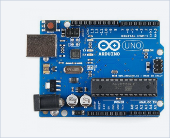
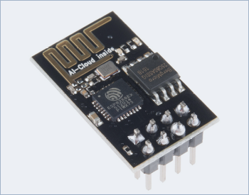
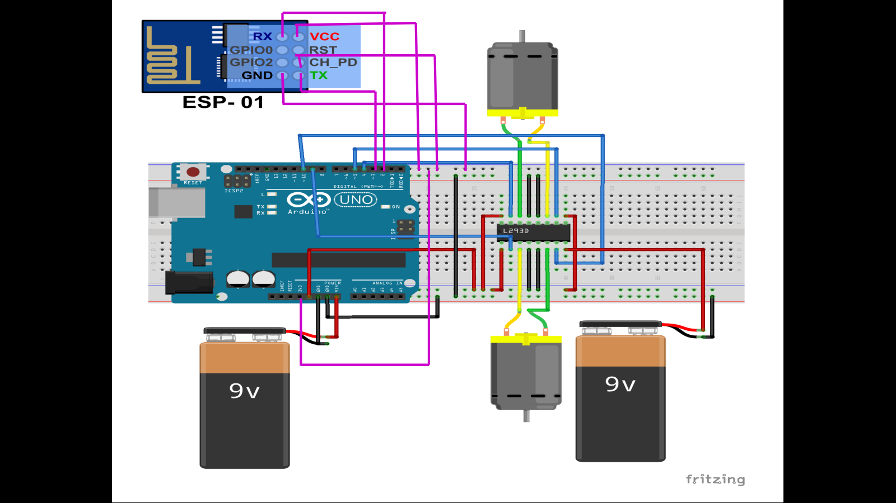
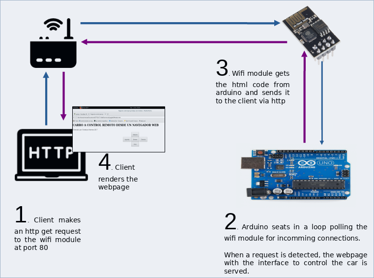
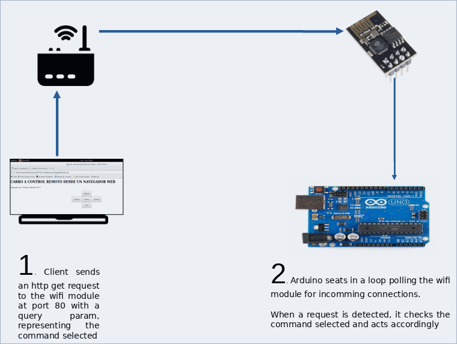
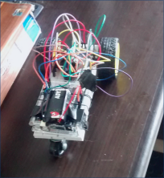

# Remote control car using Arduino and Wifi
This project was made using an Arduino UNO and an ESP8266 Wifi module

## Arduino UNO

## ESP8266 Wifi

## Physical connections

## Establishing connection

## User commands car to do something

## Picture of the build car :)

